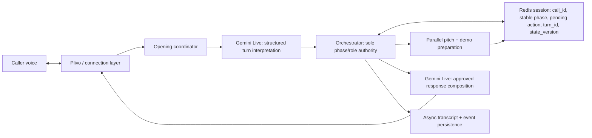

# Live Demo Orchestrator Architecture

## Non-negotiable rules

- Gemini extracts intent and composes language; it never changes phase, role, business, or completion.
- The connection layer owns carrier audio, interruptions, reconnects, and hang-up only.
- The orchestrator is the single reducer for every caller turn.
- Redis is the live-turn source of truth. Postgres writes are asynchronous audit/event writes and never block a tool result.
- A tool response is valid only for its `call_id`, `turn_id`, and `expected_state_version`.
- The stable phase advances only after the connection layer confirms carrier audio for the approved action began. Until then the action is pending and cancellable by barge-in.

## States

`business_discovery` → `prepare_experiences` → `experience_choice` → (`tailored_pitch` | `demo_scenario`) → `customer_request` → `simulated_answer` → `task_confirmation` → `demo_feedback` → `business_value_offer` → `anything_else` → `closing` → `ended`.

Pitch-first may go `tailored_pitch` → `demo_offer` → `demo_scenario` on acceptance, or directly to `closing` on decline. Demo-first offers the prepared tailored pitch after feedback; a decline proceeds to `anything_else`.

## Live-turn contract

1. Gemini submits exactly one constrained `submit_turn_interpretation` call for a caller turn.
2. The orchestrator reads/writes the per-call Redis session with compare-and-set semantics and returns one approved action or `no_op`.
3. `no_op` is returned for duplicate, stale, unsupported, or cancelled calls; Gemini must not speak from it.
4. The connection layer commits an approved pending action only after its first carrier audio frame is sent.
5. A barge-in before that commit cancels the pending action and preserves the prior stable phase.

## Intent contract

`intent` is an enum: `accept`, `decline`, `provide_detail`, `customer_request`, `feedback`, `ask_more`, `change_choice`, `stop`, `unclear`, `unrelated`.

`clarity` is required: `clear` or `unclear`. The orchestrator validates intent against the active phase; unsupported intent becomes phase-specific recovery, never a transition.

## Preparation

After validated business discovery, launch pitch and demo preparation concurrently. Store `{status: preparing|ready|failed, data}` per artifact under the call session. Bridge once at 750 ms; mark an artifact failed after 2.5 s. Never invent an unprepared pitch or demo.

## Language and recovery

Every action includes response language. Keep `preferred_language`, detect `turn_language`, and switch preference only on an explicit request or two consecutive clear turns in another supported language. All configured languages use the same enum contract.

Recovery is bounded: two clarifications for discovery/customer requests/confirmation; then use the documented phase fallback or close without claiming task completion. Recovery decisions must be documented beside each transition.

## Storage isolation

All keys include tenant and call identity: `woxza:{tenant_id}:call:{call_id}:session`, `:pitch`, and `:demo`. Preparation writes require the current state version and idempotency key; stale jobs are discarded.
