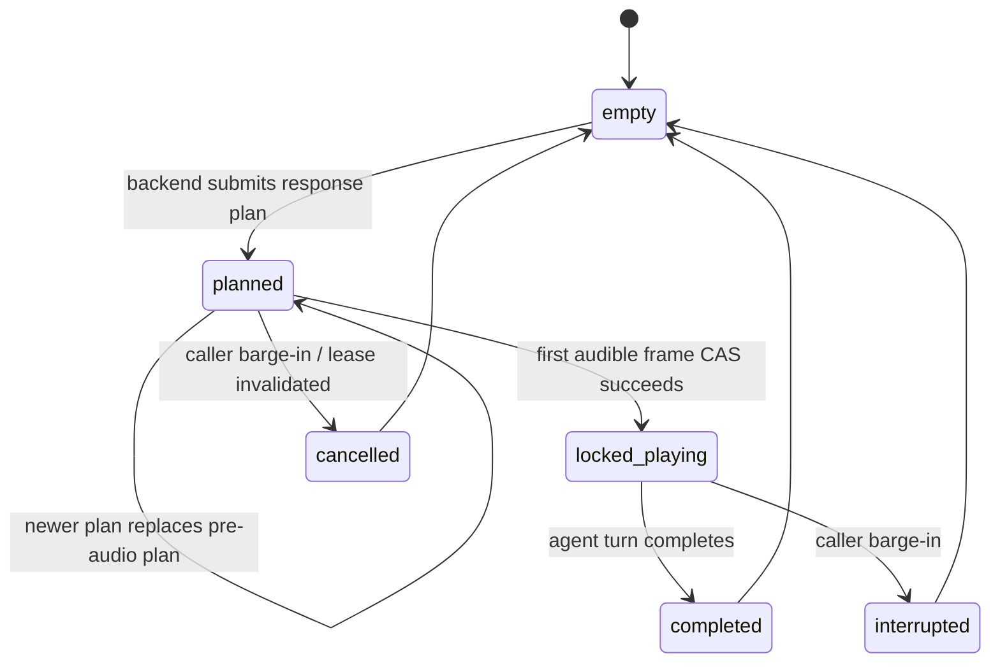

# Response coordinator implementation plan

## Scope

This is a speech-delivery-layer change only. It does not change Fix A+B
canonical caller-turn creation, one-shot interpretation, immutable accepted
interpretations, leases, memory facts, or outbox semantics.

Its sole job is to ensure one committed caller turn has at most one active
caller-facing response plan and one authorized speech owner.

## The precise lock boundary

The coordinator locks a response plan at the first **non-silent PCM frame
accepted for carrier delivery**. Concretely, this is immediately before the
first call to `plivoStream.playAudio(...)` / Twilio media `send(...)` for a
frame where `isPcmAudible(frame)` is true.

This is the boundary because:

- TTS/Gemini synthesis start is too early: it is still safe to replace an
  inaudible draft.
- Carrier playback acknowledgement is unavailable/reliably delayed in the
  streaming providers, so it cannot provide a safe synchronous boundary.
- Handing the first audible frame to the carrier is the last point at which
  replacement is guaranteed not to cut a sentence from the caller's view.

`lockAndAuthorizeFirstAudibleFrame(planId)` is a single synchronous,
compare-and-set operation in the coordinator. It moves only
`authorized_pre_audio -> locked_playing`; it fails for every other state.
The PCM writer checks that result before handing the frame to the carrier.
Thus two producers cannot both observe themselves as pre-lock.

## Coordinator state machine



Each plan contains:

```js
{
  plan_id, call_id, session_epoch, caller_turn_lease_id,
  owner,                   // workflow | memory_confirmation | direct_system
  action, response_context,
  state,                   // planned | locked_playing | completed | cancelled
  created_at, locked_at, completed_at,
  deferred_slot,           // one bounded slot per caller turn
  supersedes_plan_id: null
}
```

`owner` is descriptive/audit data only. It does not create separate delivery
paths: every owner submits through the same API.

## Plan replacement and deferred results

Before lock, the coordinator may replace a planned response. For example,
memory confirmation replaces a discovery action in the same caller turn:

```text
workflow plan (planned, no audio)
  -> memory confirmation plan replaces it
  -> workflow draft discarded as superseded
  -> only memory-confirmation plan may render/speak
```

After lock, a result cannot replace or interrupt the active plan. It may be
placed in the single `deferred_slot` for the *next* caller turn only when it
is semantically valid after the current response. Otherwise it is obsolete.

Bound: one deferred result per call/session epoch. Newest valid deferred result
wins; it replaces the older deferred item. The old item is discarded and
logged with `reason=deferred_superseded`. This prevents stale memory/workflow
actions from stacking and surfacing several turns later.

For this first implementation, memory confirmation is not deferred after a
locked discovery response; it becomes obsolete. A confirmation must be the
single response plan for its source caller turn, otherwise it is confusing.

## Barge-in behavior

Caller barge-in is the only permitted interruption of a locked plan.

On `activityStart` after speech has locked:

1. Atomically transition `locked_playing -> interrupted`.
2. Immediately clear Plivo/Twilio queued audio and cancel the in-flight Live
   generation.
3. Emit `response_interrupted` with the plan id and elapsed audible duration.
4. Discard the interrupted plan's remaining content. It is **not** reused or
   automatically deferred because the caller deliberately took the turn and
   may be correcting or changing topic.
5. The new caller utterance creates its ordinary canonical turn and obtains a
   new response plan.

If barge-in occurs while a plan is still pre-audio, transition it to
`cancelled` and log it; no audio may start afterward.

## Draft observability

Every non-delivered response result is recorded as one of:

- `response_plan_created`
- `response_plan_replaced`
- `draft_discarded` — spontaneous Live output, stale epoch, superseded plan,
  unapproved output, or interrupted draft
- `response_deferred`
- `response_interrupted`
- `response_plan_locked`
- `response_plan_completed`

Payload includes call id, plan id, caller-turn lease id, epoch, owner, action,
reason, and a transcript-row reference or redacted text length/hash. Do not
put full caller text or raw phone numbers in `call_events`; the linked
canonical turn/transcript record remains the authoritative text source.

## Generalization requirement

`ResponseCoordinator.submitPlan()` is the only route to carrier-facing agent
speech. It applies uniformly to:

- discovery and workflow responses
- memory confirmation
- pitch/demo actions
- direct system recovery/closing actions
- future tools or providers

Gemini Live output is always a draft. Its PCM may reach the carrier only when
`ResponseCoordinator.acceptDraftAudio(planId, pcm)` authorizes it. Raw audio
with no current plan id is discarded and logged as `draft_discarded` with
`reason=unowned_live_output`.

This explicitly removes the present two-producer condition: Gemini cannot
spontaneously speak from caller audio while a backend plan is pending.

## File-by-file implementation

### `backend/src/demo/response-coordinator.js` (new)

- Implement the state machine, synchronous CAS lock, one deferred slot,
  submit/replace/cancel/interrupt/complete APIs, and event callback.
- Make it dependency-injectable (`now`, id generation, event sink) for
  deterministic tests.

### `backend/src/demo/gemini-bridge.js`

- Instantiate one coordinator per Live call/session.
- Replace direct `pendingOrchestratorAction`, raw Live PCM forwarding, and
  ad-hoc authorization variables with coordinator plan ids.
- Canonical accepted workflow/memory results call `submitPlan`; a newer
  pre-audio plan replaces an older one.
- In `streamingGuard.onAudio`, pass every Live PCM draft through
  `acceptDraftAudio` before `onAudio`/carrier output. Discard and log
  unowned, stale, superseded, or post-interrupt drafts.
- Mark plan completed on agent turn completion; invoke coordinator interruption
  on `content.interrupted` and provider activity start.
- Direct responses (opening, closing, safety retry) create explicit
  `direct_system` plans rather than bypassing the coordinator.

### `backend/src/demo/output-guardrail.js`

- Keep content safety checks, but return draft metadata rather than deciding
  carrier eligibility. The coordinator becomes the sole delivery authority.

### `backend/src/demo/caller-turn-controller.js`

- Preserve immediate barge-in detection. Add a callback carrying activity
  start so the bridge can atomically interrupt/cancel the active plan before
  clearing carrier audio.

### `backend/src/call-events.js` / migration

- Add the coordinator event names to the allowed call-event type mechanism if
  needed. The current regex type constraint accepts them; add a migration only
  if an environment still has an older enum/check constraint.

### `backend/src/demo/orchestrator.js` and memory modules

- No interpretation, lease, or fact-ledger changes.
- Their outputs become response-plan proposals rather than direct Live prompts.

## Required tests

1. One caller turn with workflow and memory proposals before audio produces
   one locked plan; memory replaces workflow and workflow is logged discarded.
2. Two simultaneous first-audio attempts: exactly one CAS succeeds and only
   its PCM reaches the carrier.
3. Unowned spontaneous Gemini audio is discarded and logged; it never reaches
   Plivo/Twilio.
4. A result arriving after lock cannot interrupt; it is deferred only if valid.
5. Two late valid deferred results: newest remains; older emits
   `deferred_superseded`.
6. A late memory confirmation after lock is obsolete, not deferred.
7. Barge-in stops locked audio immediately, logs interruption, and discards
   remaining plan text; the next caller turn starts cleanly.
8. Barge-in before first audible frame cancels the plan and prevents later
   draft audio from playing.
9. Every current speech producer—workflow, memory, direct recovery, closing,
   and safety retry—must pass a test proving it uses the coordinator.
10. Regression replay of the hardware-shop trace: one confirmation/read-back
    response, then one next discovery question after affirmative; no cut-off
    or duplicate agent turn.

## Rollout

Ship disabled behind `RESPONSE_COORDINATOR_ENABLED=false`. Enable locally
first with memory flags, then replay and live-call tests. Production rollout
is independent of memory and remains gated by Fix A+B evidence.
