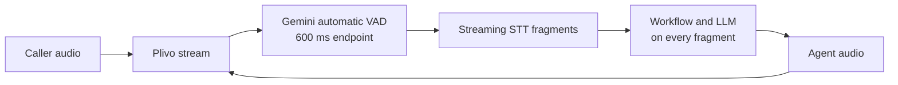
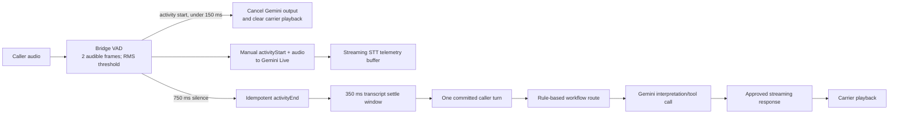

# Production voice turn-boundary fix

## Current failure path

The production replay shows that short fragments such as `medi`, `cal`, and
`distribution` were individually assigned a caller turn. Each could trigger a
new workflow decision and response, creating duplicate clarification and
discovery messages as well as repeated model latency.

## Target path

### Ownership rules

- The bridge owns activity boundaries; Gemini automatic VAD is disabled.
- `activityStart` cancels generation and clears Plivo/Twilio playback before
  any silence/endpoint decision.
- A caller turn is committed exactly once after `activityEnd`. Duplicate or
  stale end events are ignored by utterance ID.
- A resumed utterance cancels the pending workflow commit but retains the STT
  fragments, so a caller may pause to think and continue naturally.
- The workflow route is deterministic code. It does not make an additional
  model request before the Gemini interpretation/tool call.
- Plivo L16 defaults to network (big-endian) byte order and is converted to
  Gemini's little-endian PCM at the bridge.

## Initial test gate

Replay the seven production calls plus an eighth race case before rollout.

| Scenario | Required assertion |
| --- | --- |
| Fragmented business description | Exactly one workflow transition and response stream |
| Telugu/Hindi/English code switch | No response on partial syllables |
| One-word answer | One turn commits after the endpoint threshold |
| Think-pause then continuation | Fragments merge if speech resumes before commit |
| Caller barge-in during playback | Carrier clear and Gemini cancel within 150 ms |
| Duplicate STT delivery | No duplicate workflow transition |
| Silence/re-prompt | No re-prompt while caller activity is present |
| Stale/duplicate `activityEnd` | Cannot close a later utterance or commit twice |

Start with the universal 750 ms endpoint threshold. Tune it only from these
replays and production timing metrics; do not pre-classify a pause by content
type before the utterance is known.
